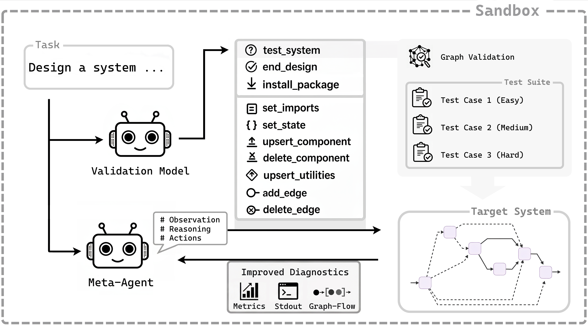

# Automated Design of Agentic Systems (ADAS) in LangGraph

A framework for the automated design, testing, and optimization of graph-structured agentic systems.

Manual engineering of complex, multi-agent workflows is time-intensive and limits the exploration of effective architectures. This project provides a **meta-system** that iteratively builds, tests, and refines target agentic systems using the [LangGraph](https://github.com/langchain-ai/langgraph) library. By operating on a code-based search space, the meta-system can autonomously discover novel control flows, integrate custom tools, and install external dependencies.

## Architecture


*The meta-system architecture: A feedback-driven refinement loop where the meta-agent generates targeted code modifications, evaluates them against an automatically generated test suite, and uses execution logs to debug and optimize its own designs.*

## Key Features & Findings

* **Modular Component Editing:** Instead of whole-file replacements or unified diffs, this framework uses component-level modifications. The meta-agent makes targeted updates to individual nodes, tools, and edges, making the design process highly scalable for complex systems.
* **Automated Validation Guardrails:** Relies on programmatic test validation and structural graph checks rather than purely subjective LLM-as-a-judge approaches. This prevents premature finalization, effectively catches structural flaws (like dead ends or infinite loops), and improves target system accuracy.

## Repository Structure

* `adas_core/`: The core logic, including the `VirtualAgenticSystem` representation, AST-based materialization, and custom LLM wrappers.
* `meta_systems/`: The implementation of the meta-agent, its tools (e.g., `UpsertComponent`, `TestSystem`), and evaluation prompts.
* `generated_systems/`: The output directory where the meta-system saves the successfully built and compiled LangGraph target systems.
* `benchmark/`: Parallelized benchmarking suites (FEVER, GSM-Hard, MMLU-Pro) to evaluate target system accuracy and resource consumption.
* `sandbox/`: Docker/Podman integration using `llm-sandbox` to safely execute and evaluate generated code in isolated environments.

---

## Quick Setup

### Environment Setup

1. Clone the repository.
2. Copy the example environment file:
   ```bash
   cp .env_copy .env
   ```
3. Edit `.env` with your API keys:
   ```
   OPENAI_API_KEY=sk-...
   ```

### Virtual Environment (recommended)

```bash
# Create virtual environment
python -m venv adasvenv

# Activate on Linux/Mac
source adasvenv/bin/activate
# OR on Windows
# .\adasvenv\bin\Activate.ps1

# Install dependencies
pip install -r requirements.txt
# OR install minimal dependencies to run the sandbox
# pip install -r requirements-min.txt
```

### Docker Setup (for sandbox execution)

The system uses Docker or Podman to create a sandbox environment for secure code execution. Make sure Docker is installed and running:

```bash
docker --version
```

## Running the System

### Creating and Running the Meta System

The meta system is an agentic system that can design other agentic systems.

**First-time run:**
```bash
python run_design.py --reinstall --keep-template
```
*Set the `--keep-template` flag in the first run to commit the installed packages to the image.*

**Options:**
* `--name`: Target system name
* `--problem`: Problem statement to solve
* `--reinstall`: Reinstall dependencies (should be set for the first run).
* `--keep-template`: Keep the image template.

### Running Scripts

The repository includes shell scripts in the `scripts/` directory to automate the design loop and run the generated systems for specific use cases (e.g., Data Analyst). These scripts are available for both Docker and Podman + SLURM.

#### 1. Iterative System Design
Use these scripts from the `scripts/` folder to generate multiple versions of an agentic system for a specific use case.

* **Docker:** `scripts/run_script_docker.sh`
* **Podman:** `scripts/run_script_podman.sh`

**Configuration:**
Open the script and modify the variables to target specific benchmarks and iterations.

#### 2. Running Generated Systems
Use these scripts from the `scripts/` folder to execute specific versions of your generated systems with a defined input state.

* **Docker:** `scripts/run_target_docker.sh`
* **Podman:** `scripts/run_target_podman.sh`

**Configuration:**
Edit the `SYSTEM_NAMES` array and `INPUT_STATE` to define what to run:

```bash
# List of generated system names to execute
SYSTEM_NAMES=(
    "data_analyst_gpt4_v1"
    "data_analyst_gpt4_v2"
)

# Initial state for the agents
INPUT_STATE='{"analysis_task": "Create a heatmap showing..."}'
```

---

## Acknowledgments & Citation

This work builds upon the foundational Automated Design of Agentic Systems (ADAS) concept introduced by Hu et al.:
> Hu, S., Lu, C., & Clune, J. (2025). *Automated Design of Agentic Systems*. Published as a conference paper at ICLR 2025. arXiv:2408.08435v2.