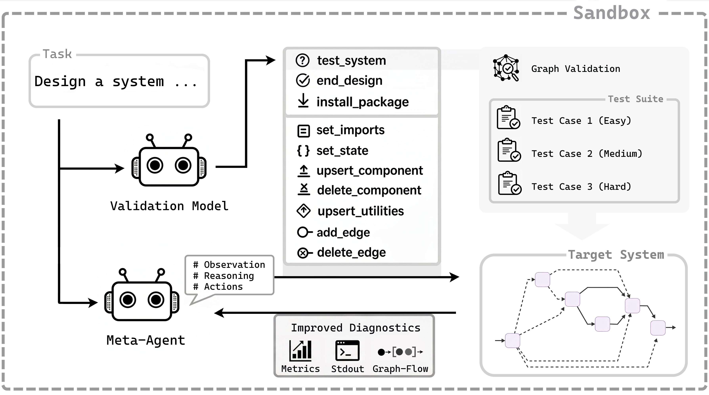

# Automated Design of Agentic Systems (ADAS) in LangGraph

A framework for the automated design, testing, and optimization of graph-structured agentic systems.

Manual engineering of complex, multi-agent workflows is time-intensive and limits the exploration of effective architectures. This project provides a **meta-system** that iteratively builds, tests, and refines target agentic systems using the [LangGraph](https://github.com/langchain-ai/langgraph) library. By operating on a code-based search space, the meta-system can autonomously discover novel control flows, integrate custom tools, and install external dependencies.

## Architecture


*The meta-system architecture: A feedback-driven refinement loop where the meta-agent generates targeted code modifications, evaluates them against an automatically generated test suite, and uses execution logs to debug and optimize its own designs.*

## Key Features & Findings

* **Modular Component Editing:** Instead of whole-file replacements or unified diffs, this framework uses component-level modifications. The meta-agent uses `manage_node`, `manage_tool`, `manage_conditional_edge`, `manage_edge`, and `manage_utilities` to make targeted changes to a virtual system.
* **Explicit Lifecycle and Routing:** Nodes, tools, conditional edges, and utilities use `create`, `update`, and `delete` actions. Conditional edges require an explicit `path_map` from each condition-function return value to a destination node or `END`.
* **Safe Graph and Utility Changes:** Deleting a node also removes standard edges connected to it and conditional edges that route to it. Utility deletion identifies the exact top-level `function`, `class`, or `assignment`, so same-named definitions can be removed unambiguously.
* **Automated Validation Guardrails:** Relies on programmatic test validation and structural graph checks rather than purely subjective LLM-as-a-judge approaches. This prevents premature finalization, effectively catches structural flaws (like dead ends, invalid path-map destinations, or infinite loops), and improves target system accuracy.

* **Example Design Session Trace:** View a complete, step-by-step design log of an automatic Data Analyst agent in [assets/example_trace.md](assets/example_trace.md).

## Repository Structure

* `adas_core/`: The core logic, including the `VirtualAgenticSystem` representation, AST-based materialization, and custom LLM wrappers.
* `meta_system/`: The implementation of the meta-agent, its management tools (`ManageNode`, `ManageTool`, `ManageConditionalEdge`, `ManageEdge`, `ManageUtilities`), and evaluation prompts.
* `generated_systems/`: The output directory where the meta-system saves the successfully built and compiled LangGraph target systems.
* `benchmark/`: Parallelized benchmarking suites (FEVER, GSM-Hard, MMLU-Pro) to evaluate target system accuracy and resource consumption.
* `sandbox/`: Docker/Podman integration using `llm-sandbox` to safely execute and evaluate generated code in isolated environments.

---

## Quick Setup

### Environment Setup

1. Clone the repository.
2. Copy the example environment file:
   ```bash
   cp .env_copy .env
   ```
3. Edit `.env` with your API keys:
   ```
   OPENAI_API_KEY=sk-...
   ```

### Virtual Environment (recommended)

```bash
# Create virtual environment
python -m venv adasvenv

# Activate on Linux/Mac
source adasvenv/bin/activate
# OR on Windows
# .\adasvenv\Scripts\Activate.ps1

# Install dependencies
pip install -r requirements.txt
# OR install minimal dependencies to run the sandbox
# pip install -r requirements-min.txt
```

### Docker Setup (for sandbox execution)

The system uses Docker or Podman to create a sandbox environment for secure code execution. Make sure Docker is installed and running:

```bash
docker --version
```

## Running the System

### Creating and Running the Meta System

The meta system is an agentic system that can design other agentic systems.

**Run design:**
```bash
python run_design.py
```
*Dependencies are installed into a persisted local sandbox image once per dependency version, then reused by later runs.*

**Options:**
* `--name`: Target system name
* `--problem`: Problem statement to solve
* `--reinstall`: Force re-installation of dependencies.

### Running Scripts

The repository includes a central Python engine (`scripts/orchestrator.py`) and thin SLURM shell wrappers in the `scripts/` directory to automate system generation, benchmarking, and target execution across Docker and Podman environments.

#### 1. Python Orchestrator (`scripts/orchestrator.py`)
The orchestrator manages base and temporary container builds via the Docker Python SDK, dependency parsing from JSON metrics files, execution timeout enforcement, and CSV/text result aggregation.

* **Run Benchmarks:**
  ```bash
  python scripts/orchestrator.py --task benchmark --benchmark mmlu --type ablationC --iterations 1-16
  ```
* **Iterative System Design:**
  ```bash
  python scripts/orchestrator.py --task design --benchmark gsm --type ablationC --iterations 1-10
  ```
* **Run Target Systems:**
  ```bash
  python scripts/orchestrator.py --task target --system-names data_analyst_gpt5_v0 --state '{"messages": []}'
  ```

#### 2. HPC / SLURM Wrappers
Thin wrappers isolate SLURM `#SBATCH` directives and environment activation from application logic:
* `scripts/slurm_benchmark.sh`: Submits benchmark jobs via `sbatch scripts/slurm_benchmark.sh`.
* `scripts/slurm_design.sh`: Submits system design jobs via `sbatch scripts/slurm_design.sh`.
* `scripts/slurm_target.sh`: Submits target execution jobs via `sbatch scripts/slurm_target.sh`.

---

## Acknowledgments & Citation

This work builds upon the foundational Automated Design of Agentic Systems (ADAS) concept introduced by Hu et al.:
> Hu, S., Lu, C., & Clune, J. (2025). *Automated Design of Agentic Systems*. Published as a conference paper at ICLR 2025. arXiv:2408.08435v2.
